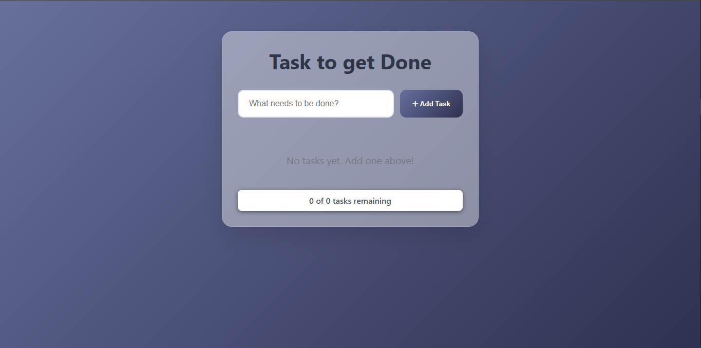

<!-- @format -->

# Todo List App

## Description

A responsive and professional todo application with the storage persistent ans smooth animation

## Features

- Add new tasks
- Delete task
- Edit task
- Mark completed tasks
- Persistent Storage
- Tasks Load automatically on page refresh
- Smooth animation
- Responsive UI

## Tech Stack

HTML, CSS and Javascript

## Live Demo

https://abduols.github.io/week4-abduol-todo/

## Screenshots

## Installation

1. Clone repo
2. Open index.html in your browser
3. create you todo list
4. Done

## Author

Abdulbasid Yahaya
